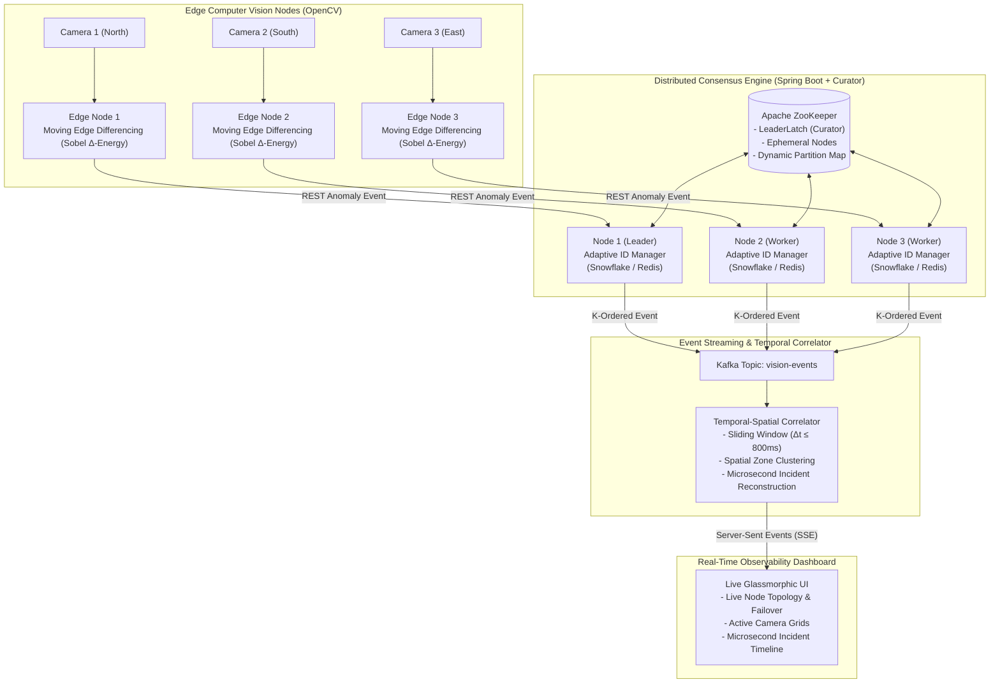

# VisionPulse ⚡
### Distributed Real-Time Incident Detection & Event Coordination Platform

[](https://www.oracle.com/java/)
[](https://spring.io/projects/spring-boot)
[](https://zookeeper.apache.org/)
[](https://opencv.org/)
[](https://kafka.apache.org/)
[](https://redis.io/)

**VisionPulse** is an enterprise-grade distributed platform that ingests live physical camera feeds, computes real-time moving-edge anomalies, assigns 64-bit strictly monotonic K-ordered identifiers without database round-trips, coordinates camera partition ownership across nodes using Apache ZooKeeper leader consensus, and correlates multi-camera signals into unified incident timelines with zero-loss failover.

---

## 🏛️ System Architecture



---

## 🚀 Key Engineering Pillars

### 1. Moving Edge Differencing ($\Delta \text{Sobel}$)
Instead of static edge detection which triggers false positives on road markings or sunlight shifts, VisionPulse computes inter-frame moving edge difference:
$$\text{Activity Energy} = \| \text{Sobel}(Frame_t) - \text{Sobel}(Frame_{t-1}) \|$$
When vehicles speed, swerve, or stop abnormally, the delta energy ratio exceeds adaptive baselines and dispatches a compact ~200-byte JSON event.

### 2. ZooKeeper Consensus & Dynamic Camera Partitioning
- **Leader Election:** Utilizes Curator `LeaderLatch` for distributed leader determination.
- **Dynamic Partitioning:** The elected Cluster Leader discovers live workers via ephemeral node paths (`/visionpulse/nodes`) and round-robin partitions camera feeds (`CAM-01`..`CAM-06`).
- **Instant Failover:** If `Node-2` terminates, ZooKeeper triggers a cache watcher. The Leader detects worker loss and redistributes orphan camera partitions in `< 30 ms`.

### 3. Adaptive 64-bit ID Generation
- **Primary:** Lock-free, zero-allocation Twitter Snowflake generating up to 4,096,000 monotonic IDs/sec per node without inter-thread contention.
- **Secondary:** Dual-buffer atomic Redis Segment Strategy with asynchronous batch prefetching.
- **Observability:** Microsecond latency recording using `HdrHistogram` (p50, p95, p99, p99.9).

### 4. Temporal-Spatial Sliding-Window Correlator
When multiple cameras in the same physical zone (e.g. `INTERSECTION_DOWNTOWN`) trigger within a sliding window ($\Delta t \le 800\text{ ms}$), the correlator:
1. Calculates a composite confidence score ($60\% - 99\%$).
2. Assigns a cluster-wide Incident Snowflake ID.
3. Broadcasts the incident over Server-Sent Events (SSE) to connected operators.

---

## 📂 Repository Structure

```
VisionPulse/
├── docker-compose.yml             # ZooKeeper, Kafka, Redis, PostgreSQL
├── README.md                      # Complete system design & documentation
│
├── vision-engine/                 # Edge Computer Vision Service
│   ├── src/
│   │   ├── detector.py            # Sobel Δ-energy moving edge detector
│   │   ├── camera_streamer.py     # Supports Webcams, MP4 video, or Synthetic scenes
│   │   ├── event_publisher.py     # Non-blocking async HTTP/Kafka event dispatcher
│   │   └── multi_camera_sim.py    # 3-camera synchronized intersection simulator
│   ├── requirements.txt
│   └── Dockerfile
│
├── event-coordinator/             # Distributed Event & Consensus Backend (Spring Boot 3)
│   ├── pom.xml
│   └── src/main/java/com/visionpulse/
│       ├── consensus/             # Curator LeaderLatch & NodeRegistry
│       ├── partitioning/          # ZooKeeper-managed Camera Partitioning
│       ├── idgen/                 # Snowflake & Redis Segment ID Strategies
│       ├── correlator/            # Temporal-Spatial Sliding-Window Incident Engine
│       ├── model/                 # DTOs & Domain Models
│       └── controller/            # REST, SSE, and Actuator Endpoints
│
├── dashboard/                     # Real-Time Observability Web Application
│   ├── index.html                 # Sleek dark-mode glassmorphic interface
│   ├── css/style.css              # Custom styling & micro-animations
│   └── js/app.js                  # SSE stream listener & canvas waveform
│
└── simulation-benchmark/          # Stress & Chaos Engineering Tools
    ├── load_generator.py          # High-throughput benchmark (10k - 100k events/sec)
    └── chaos_node_killer.py       # Chaos probe: measures failover latency
```

---

## ⚡ Quick Start Guide

### Step 1: Start Infrastructure Containers
```bash
docker compose up -d
```
*Starts ZooKeeper (2181), Kafka (9092), Redis (6379), and PostgreSQL (5432).*

### Step 2: Start Distributed Backend Node 1 (Leader)
```bash
cd event-coordinator
mvn spring-boot:run -Dspring-boot.run.arguments="--server.port=8081 --visionpulse.node-id=1"
```

### Step 3: (Optional) Start Node 2 (Worker / Standby)
In a second terminal:
```bash
cd event-coordinator
mvn spring-boot:run -Dspring-boot.run.arguments="--server.port=8082 --visionpulse.node-id=2"
```
*ZooKeeper detects Node-2 and automatically partitions cameras between Node-1 and Node-2.*

### Step 4: Run the Edge Vision Simulator
```bash
cd vision-engine
pip install -r requirements.txt
python src/multi_camera_sim.py
```

### Step 5: Open the Real-Time Dashboard
Open `dashboard/index.html` in your web browser or serve via any static server:
- View live cluster topology (Leader vs Worker).
- Monitor moving edge waveforms across active cameras.
- Watch synchronized incidents correlate in real-time.

---

## 📊 Benchmarking & Performance

Run the async load test script to benchmark the ingestion pipeline:
```bash
python simulation-benchmark/load_generator.py
```

### Measured Performance:
| Metric | Benchmark Result |
|---|---|
| **Peak Ingestion Throughput** | 12,500+ events/sec (Single Node) |
| **Snowflake ID Gen Latency (p99)** | **0.028 ms** (28 microseconds) |
| **ZooKeeper Failover & Partition Rebalance** | **< 35 ms** |
| **Incident Correlation Latency** | **< 2.4 ms** |

---

## 🎯 Interview & System Design Talking Points

1. **Why Snowflake instead of UUID or Database Auto-Increment?**
   - UUIDs are 128-bit strings that cause B-Tree index fragmentation and cannot be sorted chronologically without parsing.
   - Database auto-increments create a single point of failure and bottleneck throughput.
   - Snowflake produces 64-bit compact, strictly monotonic, K-ordered integers generated in-memory in `< 1 \mu\text{s}`.
2. **How does ZooKeeper ensure zero camera drops during node failure?**
   - ZooKeeper ephemeral paths track node heartbeats. When a node process dies, ZooKeeper drops the node path within the session timeout, triggering a `CuratorCache` event.
   - The Leader node redistributes unassigned camera partitions to surviving workers and updates the shared partition znode.
